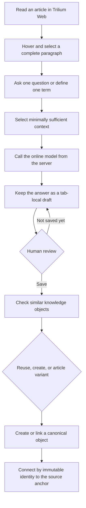
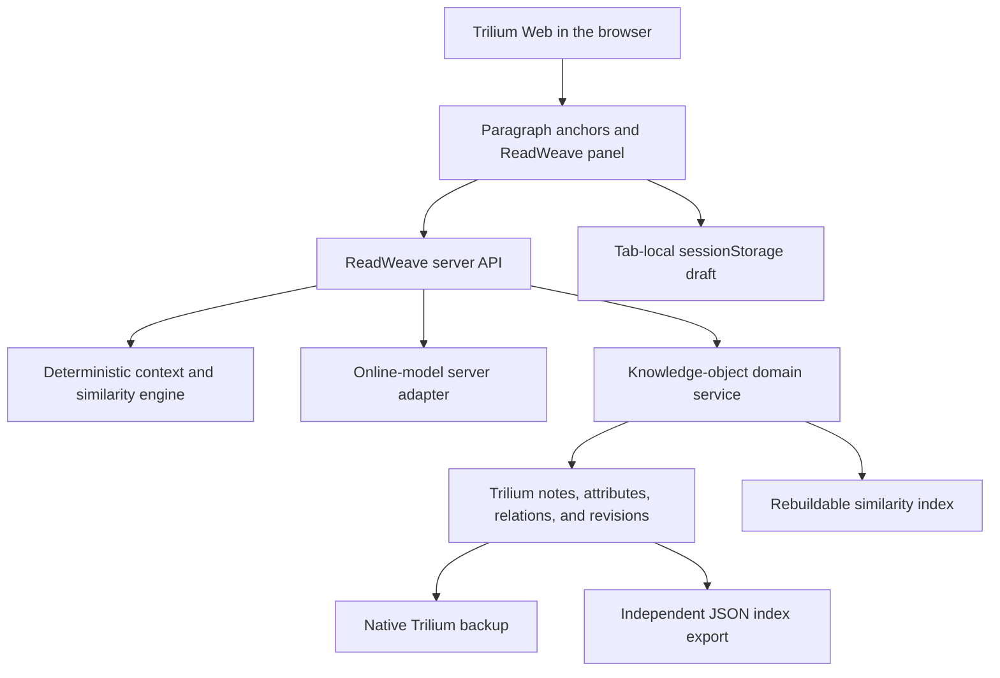

<div align="center">
  

# ReadWeave

**Turn deliberate questions during reading into reviewed, reusable knowledge that remains stably connected to its source paragraph**

[](https://github.com/AIALRA-0/ReadWeave/actions/workflows/readweave-privacy.yml)
[](https://github.com/AIALRA-0/ReadWeave/actions/workflows/codeql.yml)
[](docs/readlayer/10-IMPLEMENTATION-STATUS.md)
[](docs/readlayer/research/UPSTREAM-BASELINE.md)
[](LICENSE)

[中文](README.md) · [Core loop](#3-core-loop) · [Architecture](#5-architecture) · [Local validation](#11-local-validation) · [Implementation status](docs/readlayer/10-IMPLEMENTATION-STATUS.md)
</div>

<div align="center">
  <sub>Figure 1. ReadWeave path across paragraph anchors, session drafts, and reusable knowledge objects</sub>
</div>

## 1 Project position

ReadWeave is a Web-first personal reading-workflow modification based on TriliumNext `v0.103.0`. It is not an official TriliumNext distribution [1][2]

The user reads in Trilium Web, selects a complete paragraph, and asks one question or defines one term. The system selects minimally sufficient context, calls an online model, keeps a session draft, waits for human review, and saves approved content as an immutable-identifier knowledge object

ReadWeave does not predict questions in advance or learn preferences from behavior. The person decides what to ask, when to ask, whether to save, whether to reuse, and how to edit [3]

## 2 Base interface

<div align="center">
  

Figure 2.1. Anonymous TriliumNext base interface inherited by ReadWeave
</div>

Figure 2.1 is an upstream TriliumNext public demo screenshot. It illustrates the note tree, rich-text editor, and sidebar foundation. It is not a ReadWeave-panel screenshot and contains no personal note or deployment information

The repository currently has no ReadWeave-panel screenshot that is approved for public use. This README uses a repository-owned hero and architecture diagrams instead of fabricating a product image. A real screenshot should be added only after validation in an anonymous isolated database

## 3 Core loop

<div align="center">



Figure 3.1. Deliberate question, session draft, human review, and stable-link workflow

</div>

<div align="center">

Table 3.1. Seven-step usage flow

| Step | User action | System promise |
| --- | --- | --- |
| 1 | Hover and click a text paragraph | Select the complete paragraph and persist a stable anchor |
| 2 | Enter one question or term | Keep every generation single-question and single-answer |
| 3 | Request an answer | Select context within a deterministic budget and call the model only on the server |
| 4 | Read or edit the draft | Keep unreviewed content in the current browser session, outside the knowledge base |
| 5 | Inspect similar candidates | Highlight reusable objects while preserving create and variant choices |
| 6 | Confirm save | Create a canonical object and anchor link without using titles as foreign keys |
| 7 | Edit or export | Preview impact, then update globally, create a variant, override display, or export the index |

</div>

## 4 Product principles

<div align="center">

Table 4.1. Frozen boundaries

| Principle | Current choice | Why it matters |
| --- | --- | --- |
| Human-initiated questions | No automatic bulk question generation | Preserve reading judgment and learner agency |
| Review before persistence | Generated content first enters `sessionStorage` | The model cannot write directly into canonical knowledge |
| Identifier links | Article anchors reference immutable object IDs | Renames, homonyms, and global updates remain reliable |
| Trilium as source of truth | Notes, relations, revisions, permissions, and backup remain native | Derived similarity indexes can be deleted and rebuilt |
| Explicit preferences | Only the user can change behavioral settings | The same state and settings retain a deterministic workflow |
| Web first | Initial delivery targets Trilium Server and browsers | Desktop is not a launch dependency |
| Online model | DeepSeek is the first provider; local models are out of scope | Provider behavior stays behind a server adapter |
| Personal use | Social, multi-user, and centralized cloud knowledge are out of scope | Permission and recovery boundaries stay controlled |

</div>

## 5 Architecture

<div align="center">



Figure 5.1. Interface, server, Trilium truth data, and provider boundary

</div>

The browser can call only the ReadWeave server API and never receives the model credential. Canonical knowledge exists only in Trilium truth data. Drafts do not participate in similarity search, global references, backup promises, or index export [4]

## 6 Data model

<div align="center">

Table 6.1. Stable identifiers and ownership

| Entity | Identifier | Storage | Key semantics |
| --- | --- | --- | --- |
| Article | `articleId` | Native Trilium note | Uses `noteId`; title and path changes do not affect references |
| Paragraph anchor | `anchorId` | Persistent CKEditor model attribute | Stable after creation; paragraph order and text hashes are not keys |
| Knowledge object | `objectId` | Hidden Trilium object subtree | One reviewed Q&A or one term definition |
| Article link | `linkId` | Hidden Trilium link subtree | Uniquely connects an article, anchor, and object |
| Session draft | `articleId + anchorId` | Current tab's `sessionStorage` | Unreviewed and recoverable within the session, but not durable knowledge |
| Similar candidate | Derived index key | Rebuildable index | Discovery aid, never the source of truth |

</div>

Canonical objects and links inherit the source article's protection state. Reads and exports pass through the current Trilium protected-session check. When an object is unreadable, its title, excerpt, and similarity score remain hidden [4]

## 7 Reuse and editing

Similar-title candidates suggest reuse without blocking a distinct object or article-specific variant

Before editing an object, the UI presents its link count, article count, and article titles visible to the current session. The user then selects one of three semantics [5]

<div align="center">

Table 7.1. Three editing semantics

| Operation | Changed entity | Result in other articles |
| --- | --- | --- |
| Global update | Latest revision of the original `objectId` | Every readable link receives the new content on its next read |
| Article variant | New object, with the current `linkId` redirected | Other articles continue to reference the original object |
| Display only | Display fields on the current link | Canonical body and other links remain unchanged |

</div>

Titles, questions, answers, term names, and abbreviations never serve as link keys. Homonyms can coexist as separate objects

## 8 Context and generation

Context always includes the user question and complete target paragraph. It can then draw from the heading path, adjacent paragraphs, current section, article metadata, relevant in-article sections, and user-approved linked sources [4]

The goal is the smallest sufficient evidence set, not filling the budget. Unit tests prove that the selected paragraph is retained, the character budget is respected, unrelated paragraphs are not added merely to fill space, and relevant paragraphs can be selected [6]

The same explicit settings and state follow the same application rules, while an online model can still vary wording. ReadWeave reduces variation through pinned workflow versions, explicit model configuration, low randomness, structured validation, bounded retry, and evaluation records

## 9 Export and backup

The article sidebar exports articles, anchors, canonical objects, and links as an independent JSON file. Protocol version `1.0` includes a SHA-256 integrity digest [7]

Validation covers JSON syntax, JSON Schema 2020-12, identifier uniqueness, link foreign keys, article-anchor ownership, object types, term formatting, forbidden fields, secret patterns, and a normalized content digest

Drafts, credentials, derived vectors, and model-internal reasoning never enter the export. The first release promises export but not safe import, and the export does not replace a native Trilium database backup

## 10 Upstream capabilities

ReadWeave retains the TriliumNext personal-knowledge-base foundation. The complete upstream overview, installation methods, community channels, and translations remain available in [`docs/README.md`](docs/README.md) and the [language directory](docs) [2]

<div align="center">

Table 10.1. Inherited TriliumNext capability groups

| Group | Representative capabilities |
| --- | --- |
| Knowledge organization | Arbitrarily deep trees, cloning, attributes, relations, full-text search, and note hoisting |
| Authoring | Rich text, tables, images, math, code, canvas, Mermaid, and mind maps |
| Version safety | Note revisions, protected notes, native backup, and sync server |
| Visualization | Relation maps, note maps, geographic maps, GPX tracks, and collection tables |
| Automation | Scripts, REST API, Web Clipper, import/export, and customizable UI |
| Multi-device access | Web, desktop, touch mobile UI, dark themes, and translated interfaces |
| Scale | Upstream documentation describes knowledge bases beyond 100,000 notes |
| Operations | Metrics endpoints and a Grafana dashboard |

</div>

## 11 Local validation

The repository pins Node.js `24.15.0`, pnpm `10.33.4`, and TriliumNext `0.103.0` [8]

```bash
corepack enable # Enable the pnpm release declared by the repository
pnpm install --frozen-lockfile # Install workspace dependencies from the lockfile
pnpm server:start # Start the local Trilium Server and Web interface
```

The local default is `http://localhost:8080`. This loopback address is for development and is not a production entry point

Run the ReadWeave-focused checks

```bash
pnpm run readweave:privacy # Scan every ReadWeave change relative to the upstream baseline
pnpm run --filter server test # Run server domain and storage tests
pnpm run --filter client test # Run client tests
pnpm run --filter server-e2e test # Run browser E2E against an anonymous isolated database
pnpm client:build # Create the production client build
pnpm server:build # Create the production server build
```

Development and tests must use an anonymous isolated database. Before connecting a daily database for the first time, rehearse upgrade, backup, restoration, and rollback on a complete copy [9]

## 12 Security and privacy

- Model credentials enter only through server-side secret management. Real values must not appear in browsers, notes, exports, logs, screenshots, or Git

- Treat every credential previously transferred through an uncontrolled channel as compromised, revoke it at the provider, and create a replacement

- The anonymous test provider runs only in the in-memory database test mode. Automated tests neither read personal notes nor call the internet

- `_readweaveObjects` and `_readweaveLinks` inherit source protection. Linking from an open article cannot lower a protected object's permissions

- Commit hooks, push hooks, and GitHub Actions scan for secrets, personal paths, and ReadWeave changes relative to the upstream baseline [10]

- Public issues and screenshots must contain no deployment origin, server path, real article body, user identifier, database file, account, token, or model-usage record

## 13 Current status

ReadWeave version `0.1.0` has implemented the core personal Web reading loop and is in release acceptance [9]

Validated areas include client and server production builds, domain and storage tests, browser E2E, JSON Schema export validation, target-project type checks, dark-theme and sidebar layout, the privacy gate, and CodeQL

<div align="center">

Table 13.1. Manual gates before release

| Gate | Completion condition | Current boundary |
| --- | --- | --- |
| Credential rotation | Configure a new server credential and revoke every former one | The service owner must complete this at the provider |
| Live provider contract | Use an anonymous public article to check billing, timeout, and errors | Offline automation cannot replace a real-provider check |
| Database recovery | Rehearse upgrade, backup, restoration, and rollback on a full copy | Never point a first upgrade at the only daily database |
| Reading acceptance | The product owner reviews at least three articles in a real reading routine | Preferences become explicit settings, never implicit learning |

</div>

## 14 Repository map

<div align="center">

Table 14.1. ReadWeave maintainer entry points

| Path | Responsibility |
| --- | --- |
| [`packages/commons/src/lib/readweave.ts`](packages/commons/src/lib/readweave.ts) | Versioned object, link, context, and export domain types |
| [`packages/ckeditor5/src/plugins/readweave_anchor.ts`](packages/ckeditor5/src/plugins/readweave_anchor.ts) | Stable paragraph anchors in the editor model |
| [`apps/server/src/services/readweave_engine.ts`](apps/server/src/services/readweave_engine.ts) | Deterministic context budget and similar-title candidates |
| [`apps/server/src/services/readweave_repository.ts`](apps/server/src/services/readweave_repository.ts) | Permissions, objects, links, impact, variants, and export |
| [`apps/server/src/services/readweave_ai.ts`](apps/server/src/services/readweave_ai.ts) | Online-model server adapter and anonymous test substitute |
| [`apps/server-e2e/src/readweave.spec.ts`](apps/server-e2e/src/readweave.spec.ts) | Browser regression for review, reuse, edit propagation, and export |
| [`docs/readlayer`](docs/readlayer) | Product, UX, architecture, risk, traceability, and release evidence |
| [`scripts/readweave`](scripts/readweave) | Privacy scanning and Git-hook installation |

</div>

## 15 Upstream and license

ReadWeave follows TriliumNext under GNU Affero General Public License v3.0 only. See [`LICENSE`](LICENSE) for the complete terms [11]

The original Trilium concept came from zadam, and the community project is maintained by Elian Doran and many contributors. ReadWeave preserves upstream authorship, contributor, third-party component, translation, and sponsorship information in the upstream documentation and repository history [2]

ReadWeave is intended as a long-lived, upstream-mergeable modification. Every upstream merge should record the baseline, conflicts, database version, dependency changes, and regression evidence

## 16 References

[1] AIALRA-0, “ReadWeave quick guide,” [`README_READWEAVE.md`](README_READWEAVE.md), 2026

[2] TriliumNext, “Trilium Notes project documentation,” [`docs/README.md`](docs/README.md), 2026

[3] AIALRA-0, “ReadWeave product overview,” [`docs/readlayer/README.md`](docs/readlayer/README.md), 2026

[4] AIALRA-0, “ReadWeave technical architecture,” [`docs/readlayer/03-ARCHITECTURE.md`](docs/readlayer/03-ARCHITECTURE.md), 2026

[5] AIALRA-0, “ReadWeave interaction specification,” [`docs/readlayer/02-UX-SPEC.md`](docs/readlayer/02-UX-SPEC.md), 2026

[6] AIALRA-0, “Deterministic context engine tests,” [`apps/server/src/services/readweave_engine.spec.ts`](apps/server/src/services/readweave_engine.spec.ts), 2026

[7] AIALRA-0, “ReadWeave index export protocol,” [`docs/readlayer/08-INDEX-EXPORT.md`](docs/readlayer/08-INDEX-EXPORT.md), 2026

[8] TriliumNext and AIALRA-0, “Workspace runtime metadata,” [`.nvmrc`](.nvmrc) and [`package.json`](package.json), 2026

[9] AIALRA-0, “ReadWeave implementation and acceptance status,” [`docs/readlayer/10-IMPLEMENTATION-STATUS.md`](docs/readlayer/10-IMPLEMENTATION-STATUS.md), 2026

[10] AIALRA-0, “ReadWeave privacy workflow,” [`.github/workflows/readweave-privacy.yml`](.github/workflows/readweave-privacy.yml), 2026

[11] Free Software Foundation, “GNU Affero General Public License version 3,” [`LICENSE`](LICENSE), 2007
