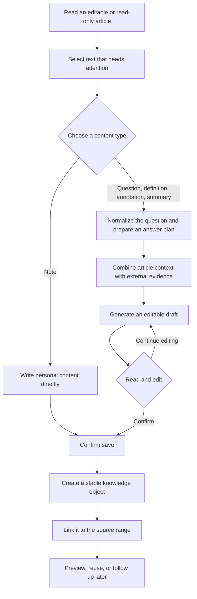

<div align="center">

<h1>ReadWeave</h1>

<p><strong>Ask, verify, understand, and retain knowledge beside the source without interrupting reading or letting a model rewrite the article</strong></p>

<p>
  <a href="README.md">简体中文</a> ·
  <a href="#2-core-experience">Core experience</a> ·
  <a href="#4-quick-start">Quick start</a> ·
  <a href="docs/readlayer/README.md">Design docs</a> ·
  <a href="docs/readlayer/10-IMPLEMENTATION-STATUS.md">Implementation status</a> ·
  <a href="https://github.com/AIALRA-0/ReadWeave/actions">Automated checks</a>
</p>


<sub>Figure 1. Select source text, generate from evidence, review the draft, and save reusable knowledge</sub>

</div>

## 1 What ReadWeave is

ReadWeave is a personal web reading workflow built on TriliumNext `0.104.0`

Select text in an editable or read-only article, then ask a question, generate a definition, add an explanatory annotation, condense a summary, or write a personal note. Generated content remains an editable sidecar draft until you explicitly save it as reusable knowledge

ReadWeave does not try to read on your behalf. It reduces the mechanical work of researching a question, assembling context, recording an answer, and finding that answer again

It is not an official TriliumNext release, a multi-user collaboration product, an automatic question generator, or an unattended writing system

## 2 Core experience

<div align="center">

Table 2.1. Five content types and how they are created

| Content | How it starts | Intended use | Model call |
| --- | --- | --- | ---: |
| Question | Type or assemble a question from templates | Answer a concrete reading question | Yes |
| Definition | Select a name or concept | Explain identity, operation, and boundaries | Yes |
| Annotation | Select a difficult passage | Expand the explanation without changing the source | Yes |
| Summary | Select a passage | Condense it into reviewable knowledge points | Yes |
| Note | Type directly | Preserve your own judgment, connection, or reminder | No |

</div>

- Editable and read-only articles share the same selection, preview, and sidecar-save behavior; read-only mode never writes back to the article body
- Selection immediately reveals the lightweight action entry and question preview
- The system can normalize informal questions and prepare an answer plan; turn off automatic adoption to edit that plan before writing
- External research participates by default, while article context remains an important reference rather than the only asserted source; research can be disabled for one question
- A generated result can be edited, locally rewritten, or regenerated; local rewrite replaces only the selected answer fragment
- A saved answer can be selected for a follow-up in an independent window, up to three levels deep; the parent must be saved first
- An unsaved result keeps its green reminder until a successful save clears it

## 3 From reading to knowledge

<div align="center">



<sub>Figure 3.1. ReadWeave keeps explicit human review between model generation and durable knowledge</sub>

</div>

The article retains its source text. Knowledge is stored in sidecar objects connected by stable identifiers. Titles, question text, and answer text are not link keys, so renaming and homonyms do not directly break references

Unsaved drafts can recover after a page refresh or service restart, and stale requests cannot overwrite newer edits

## 4 Quick start

### 4.1 Requirements

- Windows 10 or Windows 11
- Node.js `24.18.0`
- pnpm `11.11.0`, pinned by the repository `packageManager` field

### 4.2 First launch

First, install the locked dependencies from the repository root

```powershell
# Enable the declared package manager and install locked dependencies
corepack enable
pnpm install --frozen-lockfile
```

Second, double-click [`Start-ReadWeave.cmd`](Start-ReadWeave.cmd)

The launcher builds the server, uses the isolated `apps/server/data-readweave` data directory, and opens the local page at `http://127.0.0.1:8082`

Third, create this isolated database on first launch. Open “Options → AI / LLM → ReadWeave model settings,” save the writing-model and search configuration, and test the connection

Fourth, open a text note and select text. A successful setup shows the Question/Definition action near the source and the five content types in the right sidebar

Double-click [`Stop-ReadWeave.cmd`](Stop-ReadWeave.cmd) to stop the local instance

On other platforms, prepare the dependencies using the [upstream environment guide](docs/Developer%20Guide/Developer%20Guide/Environment%20Setup.md), then start the development service

```bash
# Start the development server and web interface
pnpm server:start
```

The development service uses `http://localhost:8080` by default

## 5 Generation, research, and cost

The writing model is configured on the server. ReadWeave supports the official DeepSeek endpoint and compatible third-party DeepSeek endpoints. The browser receives masked configuration state, never the complete credential

The research layer can combine general web results, person-oriented discovery, academic sources, and page extraction according to the question. The normal interface exposes the answer, sources, and cost summary instead of requiring readers to understand the internal routing

Per-question budget reservations use two bands:

- Routine questions reserve up to CNY 0.05
- Difficult research reserves up to CNY 0.10

Displayed cost is an estimate derived from reported token usage and configured rates, not a supplier invoice. When a third-party endpoint lacks complete rates, ReadWeave uses a conservative estimate instead of presenting unknown cost as zero

A failed search does not turn an unsupported guess into a confirmed fact. Generated content still requires human reading, and an automated check does not prove factual acceptance

## 6 Data and security boundaries

- Model and search credentials remain in local server settings or server environment variables
- Credentials must not enter browser content, notes, exports, logs, screenshots, or Git history
- Questions, definitions, annotations, summaries, and notes remain drafts until confirmation
- Read-only articles create sidecar locators and never invoke article-body save
- Saved objects and links inherit source-note protection and remain subject to Trilium protected sessions
- The independent JSON export contains articles, ranges, objects, and links, but excludes credentials, drafts, and model-internal work
- Rehearse upgrade, restore, and rollback on a complete copy before connecting an important daily database
- Trilium supports user scripts; untrusted scripts can access personal data, so install only extensions you understand and trust

Report vulnerabilities through the repository’s [private security advisory form](https://github.com/AIALRA-0/ReadWeave/security/advisories/new)

Do not paste the following into public issues:

- Credentials
- Databases
- Logs
- Real article content

## 7 Development and validation

Start with the checks directly related to ReadWeave

```bash
# Scan ReadWeave changes for credentials and personal paths
pnpm readweave:privacy

# Run server and client tests
pnpm --filter server test --run
pnpm --filter client test --run

# Build the production client and server
pnpm client:build
pnpm server:build
```

Browser regression uses an anonymous isolated database. It should not connect to personal daily data or call paid production providers

```bash
# Run the server browser end-to-end suite
pnpm --filter server e2e
```

Current scope, executed evidence, and known limits are tracked in:

- [Implementation and acceptance status](docs/readlayer/10-IMPLEMENTATION-STATUS.md)
- [Quality verification record](docs/readlayer/2026-09-quality-verification.md)
- [Writing-contract verification](docs/readlayer/writing-contract-v2.md)
- [Upstream baseline](docs/readlayer/research/UPSTREAM-BASELINE.md)

## 8 Repository entry points

- [`packages/commons/src/lib/readweave.ts`](packages/commons/src/lib/readweave.ts) — shared ReadWeave types
- [`apps/client/src/widgets/sidebar/ReadWeavePanel.tsx`](apps/client/src/widgets/sidebar/ReadWeavePanel.tsx) — ReadWeave sidebar interface
- [`apps/server/src/services/readweave_unified_ai.ts`](apps/server/src/services/readweave_unified_ai.ts) — unified generation flow
- [`apps/server/src/services/readweave_research.ts`](apps/server/src/services/readweave_research.ts) — cross-domain research flow
- [`apps/server/src/services/readweave_search.ts`](apps/server/src/services/readweave_search.ts) — search-provider adapters
- [`apps/server/src/services/readweave_repository.ts`](apps/server/src/services/readweave_repository.ts) — ReadWeave repository layer
- [`apps/server/e2e/readweave.spec.ts`](apps/server/e2e/readweave.spec.ts) — core browser regression
- [`docs/readlayer`](docs/readlayer) — ReadWeave design and verification documents

## 9 Upstream, contribution, and license

ReadWeave is a long-lived TriliumNext modification. It keeps reading-specific behavior in isolated modules where practical so upstream fixes can continue to be integrated. The [upstream documentation](docs/README.md) retains the full Trilium feature set, installation routes, contributor history, and community links

Before submitting a change, run the tests and privacy checks that match its scope. Issue reports should use reproducible steps and anonymous data, never a personal database or real model response

This repository continues under the GNU Affero General Public License v3.0 only. See [`LICENSE`](LICENSE) for the complete terms
