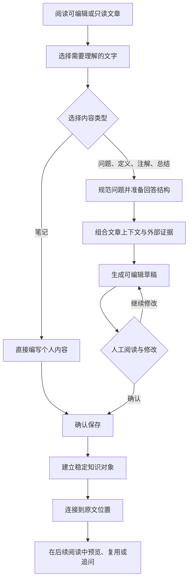

<div align="center">

<h1>ReadWeave 织读</h1>

<p><strong>在原文旁完成提问、查证、理解与沉淀，不打断阅读，也不让模型直接改写你的文章</strong></p>

<p>
  <a href="README.en.md">English</a> ·
  <a href="#2-核心体验">核心体验</a> ·
  <a href="#4-快速开始">快速开始</a> ·
  <a href="docs/readlayer/README.md">设计文档</a> ·
  <a href="docs/readlayer/10-IMPLEMENTATION-STATUS.md">实现状态</a> ·
  <a href="https://github.com/AIALRA-0/ReadWeave/actions">自动检查</a>
</p>


<sub>图 1　选择原文、依据证据生成草稿、人工审核后保存为可复用知识</sub>

</div>

## 1 ReadWeave 是什么

ReadWeave 是基于 TriliumNext `0.104.0` 的个人网页阅读工作流

你可以在可编辑文章或只读文章中选择一段文字，立即提出问题、生成定义、补充注解、浓缩总结或写下笔记；生成内容先作为可编辑草稿留在原文旁，只有你确认保存后才成为可复用知识

ReadWeave 解决的不是“让模型替你读完”，而是减少阅读过程中查资料、整理上下文、记录答案和再次找到答案的机械工作

它不是 TriliumNext 官方发行版，也不面向多人协作、自动批量出题或无人审核的自动写入

## 2 核心体验

<div align="center">

表 2.1　五种内容及其保存方式

| 内容 | 怎样得到 | 适合处理什么 | 是否调用模型 |
| --- | --- | --- | ---: |
| 问题 | 输入或从模板组合问题 | 直接回答阅读中的疑问 | 是 |
| 定义 | 选择一个名称或概念 | 解释它是什么、怎样运作及边界 | 是 |
| 注解 | 选择晦涩片段 | 在不改原文的前提下扩写解释 | 是 |
| 总结 | 选择一段内容 | 压缩为便于回看的知识点 | 是 |
| 笔记 | 直接输入 | 保存自己的判断、联想和提醒 | 否 |

</div>

- 编辑模式与只读模式使用同一套选择、预览和旁路保存行为；只读模式不会写回文章正文
- 选择完成后立即出现轻量操作入口，问题预览不需要再次点击才能显示
- 系统可以规范口语问题并生成回答结构；关闭自动采用后，你可以先修改结构，再生成答案
- 外部搜索默认参与生成，文章上下文是重要参考但不是唯一事实来源；不需要联网时可以为当前问题关闭搜索
- 生成结果可以编辑、局部改写或重新生成；局部改写只替换选中的答案片段
- 已保存回答可以继续选择并追问，最多形成三层独立浮窗；创建追问前必须先保存上级回答
- 未保存的生成结果保持绿色提醒，保存成功后提醒消失

## 3 从阅读到知识

<div align="center">



<sub>图 3.1　ReadWeave 的用户闭环；模型生成与正式保存之间始终保留人工确认</sub>

</div>

文章保存原文，知识内容保存在旁路对象中，两者通过稳定标识连接；标题、问题文字和答案文字都不充当连接键，因此重命名或同名概念不会直接破坏关联

刷新页面或重启服务后，未保存草稿仍可恢复；旧生成请求不能覆盖较新的编辑结果

## 4 快速开始

### 4.1 环境

- Windows 10 或 Windows 11
- Node.js `24.18.0`
- pnpm `11.11.0`，由仓库的 `packageManager` 字段固定

### 4.2 第一次启动

第一步，在仓库根目录安装依赖

```powershell
# 依次启用仓库声明的包管理器并安装锁定依赖
corepack enable
pnpm install --frozen-lockfile
```

第二步，双击 [`Start-ReadWeave.cmd`](Start-ReadWeave.cmd)

启动器会构建服务端，使用独立的 `apps/server/data-readweave` 数据目录，并打开本机页面；默认地址为 `http://127.0.0.1:8082`

第三步，首次打开时创建这套独立数据库，再进入“设置 → AI / LLM → ReadWeave 模型设置”，保存写作模型与搜索服务配置并测试连接

第四步，打开文本笔记并选择文字；正常结果是原文附近出现“提问／定义”入口，右侧显示当前选区和五种内容类型

需要停止时双击 [`Stop-ReadWeave.cmd`](Stop-ReadWeave.cmd)

其他平台可以按[上游环境设置文档](docs/Developer%20Guide/Developer%20Guide/Environment%20Setup.md)准备依赖，再运行开发服务

```bash
# 启动开发服务器和网页界面
pnpm server:start
```

开发服务默认使用 `http://localhost:8080`

## 5 生成、搜索与费用

写作模型通过服务端配置，支持 DeepSeek 官方接口和兼容的第三方 DeepSeek 接口；浏览器只获得掩码状态，不会收到完整密钥

搜索层按问题需要组合通用搜索、人物检索、学术来源和页面正文提取；正常界面只展示结果、来源和费用摘要，不要求读者理解内部搜索路由

每题的费用控制分为两个区间：

- 普通问题预留上限为 ¥0.05
- 困难查证预留上限为 ¥0.10

界面费用来自模型返回用量和已配置费率的估算，不等同于供应商账单；第三方接口没有完整费率时使用保守估算，避免把未知费用显示成零

搜索失败不会把未经支持的猜测包装成确定事实；生成内容仍需要用户阅读，自动检查通过不代表事实已经由人工确认

## 6 数据与安全边界

- 模型和搜索密钥只保存在服务端本地设置或服务端环境变量中
- 密钥不得进入浏览器正文、笔记、导出、日志、截图或 Git 历史
- 问题、定义、注解、总结和笔记在确认前都只是草稿
- 只读文章只创建旁路位置记录，不调用正文保存
- 正式对象和连接继承来源文章的保护状态，并继续服从 Trilium 的受保护会话
- 独立的 `JSON` 导出文件包含文章、位置、对象和连接，不包含密钥、草稿或模型内部过程
- 第一次连接重要日常数据库前，应先在完整副本上演练升级、恢复和回滚
- Trilium 支持用户脚本，运行不可信脚本可能访问个人数据；只安装你理解并信任的扩展

安全问题请使用仓库的[私密安全报告入口](https://github.com/AIALRA-0/ReadWeave/security/advisories/new)

公开问题中不要粘贴以下内容：

- 密钥
- 数据库
- 日志
- 真实文章内容

## 7 开发与验证

先运行与 ReadWeave 直接相关的检查

```bash
# 检查 ReadWeave 差异中的秘密和个人路径
pnpm readweave:privacy

# 运行服务端和客户端测试
pnpm --filter server test --run
pnpm --filter client test --run

# 构建生产客户端和服务端
pnpm client:build
pnpm server:build
```

浏览器回归使用匿名隔离数据库，不应连接个人日常数据，也不应调用真实付费接口

```bash
# 运行服务端浏览器端到端测试
pnpm --filter server e2e
```

当前实现范围、已执行证据和已知限制分别记录在：

- [实现与验收状态](docs/readlayer/10-IMPLEMENTATION-STATUS.md)
- [质量验证记录](docs/readlayer/2026-09-quality-verification.md)
- [写作合同验证](docs/readlayer/writing-contract-v2.md)
- [上游基线](docs/readlayer/research/UPSTREAM-BASELINE.md)

## 8 仓库入口

- [`packages/commons/src/lib/readweave.ts`](packages/commons/src/lib/readweave.ts) — ReadWeave 共享类型
- [`apps/client/src/widgets/sidebar/ReadWeavePanel.tsx`](apps/client/src/widgets/sidebar/ReadWeavePanel.tsx) — ReadWeave 侧栏界面
- [`apps/server/src/services/readweave_unified_ai.ts`](apps/server/src/services/readweave_unified_ai.ts) — 统一生成主流程
- [`apps/server/src/services/readweave_research.ts`](apps/server/src/services/readweave_research.ts) — 跨领域查证流程
- [`apps/server/src/services/readweave_search.ts`](apps/server/src/services/readweave_search.ts) — 搜索来源适配层
- [`apps/server/src/services/readweave_repository.ts`](apps/server/src/services/readweave_repository.ts) — ReadWeave 数据仓库层
- [`apps/server/e2e/readweave.spec.ts`](apps/server/e2e/readweave.spec.ts) — 核心浏览器回归
- [`docs/readlayer`](docs/readlayer) — ReadWeave 设计与验证文档

## 9 上游、贡献与许可

ReadWeave 是 TriliumNext 的长期修改版，尽量把阅读能力保留在独立模块中，便于继续吸收上游修复；完整的上游功能、安装方式、贡献者和社区入口保留在[上游文档](docs/README.md)

提交改动前请先运行与改动范围对应的测试和隐私检查；问题报告应包含可复现步骤和匿名数据，不要上传个人数据库或真实模型响应

本仓库沿用 GNU Affero General Public License v3.0 only，完整条款见 [`LICENSE`](LICENSE)
