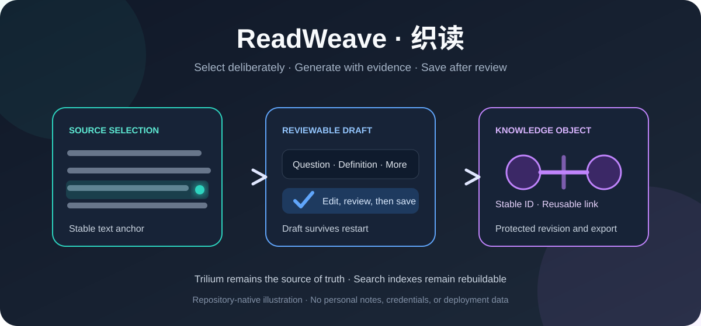
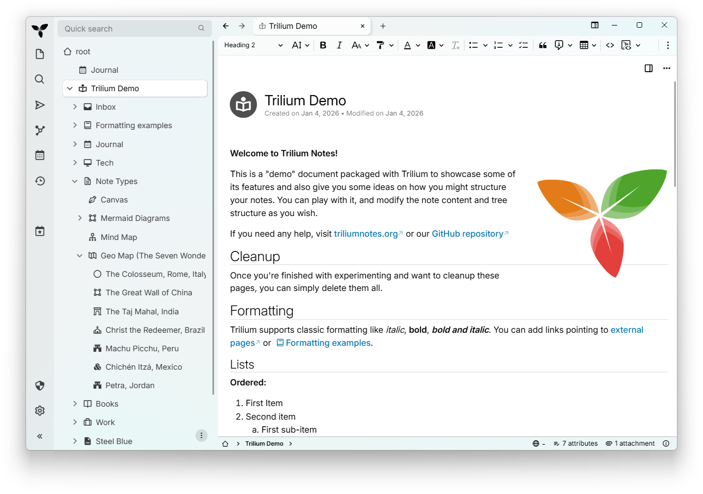
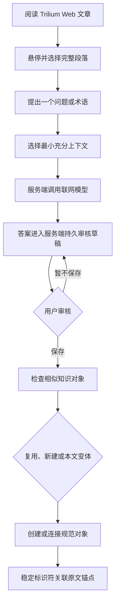
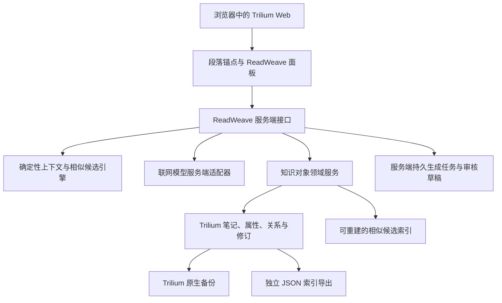

<div align="center">
  

# ReadWeave 织读

**以人的真实问题为主线，把阅读中的主动提问转化为可审核、可复用、与原文稳定关联的知识**

[](https://github.com/AIALRA-0/ReadWeave/actions/workflows/readweave-privacy.yml)
[](https://github.com/AIALRA-0/ReadWeave/actions/workflows/codeql.yml)
[](docs/readlayer/10-IMPLEMENTATION-STATUS.md)
[](docs/readlayer/research/UPSTREAM-BASELINE.md)
[](LICENSE)

[English](README.en.md) · [核心闭环](#3-核心闭环) · [系统结构](#5-系统结构) · [本地验证](#11-本地验证) · [实现状态](docs/readlayer/10-IMPLEMENTATION-STATUS.md)
</div>

<div align="center">
  <sub>图 1　段落锚点、持久审核草稿和可复用知识对象之间的织读主链路</sub>
</div>

## 1 项目定位

ReadWeave 是基于 TriliumNext `v0.104.0` 的 Web 优先个人阅读工作流修改版，不是 TriliumNext 官方发行版 [1][2]

用户在 Trilium Web 中阅读，选择完整段落并主动提出一个问题或术语

系统选择最小充分上下文并调用联网模型，同时把生成任务和待审核草稿持久化到服务端；只有用户显式确认后，内容才会保存为由稳定标识符连接的知识对象

ReadWeave 不预先猜测问题，也不根据行为自动学习偏好，人始终决定问什么、何时问、是否保存、是否复用和怎样修改 [3]

## 2 基础界面

<div align="center">
  

图 2.1　ReadWeave 继承的 TriliumNext 匿名演示基础界面
</div>

图 2.1 是上游 TriliumNext 的公开演示截图，用于说明树形笔记、富文本编辑器和侧栏基础，不是 ReadWeave 面板截图，也不包含个人笔记或部署信息

当前仓库没有可安全公开的 ReadWeave 面板截图，因此 README 使用仓库自有主视觉和结构图表达功能

真实产品截图只有在匿名隔离数据库中完成视觉验收后才会加入

## 3 核心闭环

<div align="center">



图 3.1　主动提问、持久草稿、人工审核和稳定连接流程

</div>

<div align="center">

表 3.1　七步使用流程

| 步骤 | 用户动作 | 系统承诺 |
| --- | --- | --- |
| 1 | 悬停并点击文本段落 | 选择完整段落并持久化稳定锚点 |
| 2 | 输入一个问题或术语 | 每次生成保持单问单答，不建立多轮聊天 |
| 3 | 请求回答 | 按确定性预算选择最小充分上下文，模型只在服务端调用 |
| 4 | 阅读或编辑草稿 | 草稿以 `ready-for-review` 状态持久化并可在重启后恢复，但不进入规范知识对象 |
| 5 | 查看相似候选 | 突出可复用对象，同时始终允许新建和本文变体 |
| 6 | 确认保存 | 创建规范对象和锚点连接，标题不充当外键 |
| 7 | 修改或导出 | 先预览影响范围，再全局修改、创建变体、只改显示或导出索引 |

</div>

## 4 产品原则

<div align="center">

表 4.1　已冻结的边界

| 原则 | 当前选择 | 为什么重要 |
| --- | --- | --- |
| 人主动提问 | 不自动批量生成用户可能问的问题 | 保留阅读判断和学习主动性 |
| 审核后保存 | 生成任务按 `ready-for-review → saving → saved` 流转，必须显式提交 | 模型不能直接污染正式知识库 |
| 标识符连接 | 文章锚点只保存不可变对象标识符 | 标题重命名、同名对象和全局更新保持可靠 |
| Trilium 为真相源 | 笔记、关系、修订、权限和备份留在 Trilium | 派生相似索引可以删除并重建 |
| 显式偏好 | 用户设置只能由用户明确修改 | 相同状态和设置保持确定性工作流 |
| Web 优先 | 首发面向 Trilium Server 和浏览器 | 桌面端不是首发依赖 |
| 联网模型 | 首个提供方为 DeepSeek，不支持本地模型 | 提供方经服务端适配器隔离 |
| 个人自用 | 首发不包含社交、多人和中心化云知识库 | 权限与恢复范围保持可控 |

</div>

## 5 系统结构

<div align="center">



图 5.1　界面、服务端、Trilium 真相数据和模型提供方边界

</div>

浏览器只能调用 ReadWeave 服务端接口，不能获得模型密钥；正式知识只存在于 Trilium 真相数据。持久草稿可以跨重启恢复，但在显式提交前不参与相似搜索、全局引用或索引导出 [4]

## 6 数据模型

<div align="center">

表 6.1　稳定标识符和数据归属

| 对象 | 标识符 | 保存位置 | 关键语义 |
| --- | --- | --- | --- |
| 文章 | `articleId` | Trilium 原生笔记 | 直接使用 `noteId`，标题和路径变化不影响引用 |
| 段落锚点 | `anchorId` | CKEditor 模型中的持久属性 | 创建后稳定，段落序号和文本哈希不是主键 |
| 知识对象 | `objectId` | Trilium 隐藏对象子树 | 一个已审核问答或一个术语定义 |
| 文章连接 | `linkId` | Trilium 隐藏连接子树 | 唯一关联文章、锚点和对象 |
| 生成任务与审核草稿 | `jobId + draftId` | ReadWeave 服务端数据库 | 保存状态版本、活动尝试、进度和结果；显式提交前不是规范知识 |
| 相似候选 | 派生索引键 | 可重建索引 | 只用于发现候选，不是真相源 |

</div>

规范对象和连接继承来源文章的保护状态

读取和导出都经过当前 Trilium 受保护会话的可读性检查，无权读取对象时不能泄露标题、摘要或相似度 [4]

## 7 复用修改

保存前，相似标题候选只提示复用，不阻止创建独立对象或本文变体

修改已有对象前，界面先显示连接数、文章数和当前会话可访问的文章标题，用户再从三种语义中选择 [5]

<div align="center">

表 7.1　三种修改语义

| 操作 | 修改对象 | 其他文章的结果 |
| --- | --- | --- |
| 全局修改 | 更新原 `objectId` 的最新修订 | 所有可读连接下次读取时获得新内容 |
| 本文变体 | 创建新对象，并把当前 `linkId` 指向新对象 | 其他文章继续引用原对象 |
| 只改显示 | 只修改当前连接的显示字段 | 规范对象正文和其他连接保持不变 |

</div>

标题、问题文本、答案、术语名称和缩写都不能充当连接键，同名不同义对象可以并存

## 8 上下文生成

上下文选择固定包含用户问题和完整目标段落，再从标题路径、相邻段落、当前小节、文章元数据、文章内相关小节和用户允许的链接来源逐层选择 [4]

系统目标是用最少片段达到可回答条件，不会因为预算还有空余就把无关全文发送给模型

现有单元测试验证目标段始终保留、预算上限有效、无关段落不会被填充、相关段落可以进入上下文 [6]

同一显式设置和同一状态会走相同规则，但联网模型的措辞仍可能变化

ReadWeave 通过固定工作流版本、显式模型配置、低随机度、结构校验、有限重试和评测记录降低波动

## 9 导出备份

文章侧栏可以导出文章、锚点、规范对象和连接组成的独立 JSON 文件，协议版本为 `1.0`，完整性摘要使用 SHA-256 [7]

导出依次检查 JSON 语法、JSON Schema 2020-12、标识符唯一性、连接外键、锚点文章归属、对象类型、术语格式、禁止字段、秘密模式和规范化内容摘要

草稿、服务密钥、派生向量和模型内部推理不进入导出，首发只承诺导出，不承诺安全导入，导出文件也不能替代 Trilium 原生数据库备份

## 10 上游能力

ReadWeave 保留 TriliumNext 的个人知识库基础能力，详细上游说明、安装方式、社区入口和多语言文档仍可从 [`docs/README.md`](docs/README.md) 与 [`docs/README-ZH_CN.md`](docs/README-ZH_CN.md) 查阅 [2]

<div align="center">

表 10.1　继承的 TriliumNext 能力组

| 能力组 | 代表功能 |
| --- | --- |
| 知识组织 | 任意深度笔记树、克隆、属性、关系、全文搜索和笔记提升 |
| 内容创作 | 富文本、表格、图片、数学公式、代码、画布、Mermaid 和思维导图 |
| 版本安全 | 笔记修订、受保护笔记、原生备份和同步服务器 |
| 可视化 | 关系图、笔记图、地理图、GPX 轨迹和集合表格 |
| 自动化 | 脚本、REST API、Web Clipper、导入导出和可定制界面 |
| 多端访问 | Web、桌面、触屏移动界面、暗色主题和多语言界面 |
| 规模 | 上游说明支持超过 100,000 条笔记的知识库使用场景 |
| 运营观察 | 指标端点和 Grafana 仪表板支持 |

</div>

## 11 本地验证

仓库固定 Node.js `24.18.0`、pnpm `11.11.0` 和 TriliumNext `0.104.0` [8]

```bash
corepack enable # 启用仓库声明的 pnpm 版本
pnpm install --frozen-lockfile # 按锁文件安装工作区依赖
pnpm server:start # 启动本地 Trilium Server 与 Web 界面
```

本地默认入口为 `http://localhost:8080`，该回环地址只用于开发，不代表正式部署入口

ReadWeave 定向检查如下

```bash
pnpm run readweave:privacy # 扫描相对上游基线的全部 ReadWeave 改动
pnpm run --filter server test # 运行服务端领域与存储测试
pnpm run --filter client test # 运行客户端测试
pnpm run --filter server e2e # 在匿名隔离数据库中运行浏览器端到端测试
pnpm client:build # 生成客户端生产构建
pnpm server:build # 生成服务端生产构建
```

开发和测试必须使用匿名隔离数据库，第一次连接日常数据库前，需要在完整副本上完成升级、备份、恢复和回滚演练 [9]

## 12 安全隐私

- 模型密钥只通过 Web 服务端秘密管理注入，浏览器、笔记、导出、日志、截图和仓库都不能保存真实值

- 任何曾通过非受控渠道传输的密钥都应先在提供方控制台吊销，再创建替代密钥

- 匿名测试模型只允许在内存数据库测试模式下启用，自动化测试不读取个人笔记或访问互联网

- `_readweaveObjects` 和 `_readweaveLinks` 继承来源内容的保护边界，开放文章不能降低受保护对象权限

- Git 提交钩子、推送钩子和 GitHub Actions 会扫描秘密、个人路径和 ReadWeave 相对上游的变更 [10]

- 公开问题和截图不得包含正式网址、服务器路径、真实文章正文、用户标识、数据库文件、账户、令牌或模型用量记录

## 13 当前状态

产品版本为 `0.1.0`，核心个人 Web 阅读闭环已实现并进入发布验收 [9]

已验证范围包括客户端和服务端生产构建、领域与存储测试、浏览器端到端、JSON Schema 导出校验、目标项目类型检查、暗色主题与侧栏布局、隐私门禁和 CodeQL

<div align="center">

表 13.1　发布前人工门槛

| 门槛 | 完成条件 | 当前边界 |
| --- | --- | --- |
| 密钥轮换 | 服务端配置新密钥，旧密钥完成吊销 | 必须由服务所有者在提供方控制台执行 |
| 真实提供方契约 | 使用匿名公开文章验证计费、超时和错误提示 | 自动化测试不代替真实提供方检查 |
| 数据库恢复 | 在日常数据库完整副本上完成升级、备份、恢复和回滚 | 禁止首次升级指向唯一日常数据库 |
| 真实阅读验收 | 产品所有者使用至少三篇文章核对阅读习惯 | 偏好只能转为显式设置，不启用隐式学习 |

</div>

## 14 仓库地图

<div align="center">

表 14.1　ReadWeave 维护入口

| 路径 | 职责 |
| --- | --- |
| [`packages/commons/src/lib/readweave.ts`](packages/commons/src/lib/readweave.ts) | 版本化对象、连接、上下文和导出领域类型 |
| [`packages/ckeditor5/src/plugins/readweave_anchor.ts`](packages/ckeditor5/src/plugins/readweave_anchor.ts) | 把稳定段落锚点持久化到编辑器模型 |
| [`apps/server/src/services/readweave_engine.ts`](apps/server/src/services/readweave_engine.ts) | 确定性上下文预算和相似标题候选 |
| [`apps/server/src/services/readweave_repository.ts`](apps/server/src/services/readweave_repository.ts) | 权限、对象、连接、影响范围、变体和导出 |
| [`apps/server/src/services/readweave_ai.ts`](apps/server/src/services/readweave_ai.ts) | 服务端联网模型适配和匿名测试替身 |
| [`apps/server/e2e/readweave.spec.ts`](apps/server/e2e/readweave.spec.ts) | 审核、复用、修改传播和导出浏览器回归 |
| [`docs/readlayer`](docs/readlayer) | 产品需求、交互、架构、风险、追溯和发布证据 |
| [`scripts/readweave`](scripts/readweave) | 隐私扫描和 Git 钩子安装 |

</div>

## 15 上游许可

ReadWeave 延续 TriliumNext 的 GNU Affero General Public License v3.0 only，完整许可文本见 [`LICENSE`](LICENSE) [11]

TriliumNext 的原始概念来自 zadam，社区项目由 Elian Doran 和其他贡献者持续维护

ReadWeave 保留上游作者、贡献者、第三方组件、翻译和赞助信息，完整署名可在上游说明和仓库历史中查阅 [2]

ReadWeave 是长期可合并的修改版，后续合并上游时需要记录基线、冲突、数据库版本、依赖变化和回归证据

## 16 参考资料

[1] AIALRA-0, “ReadWeave quick guide,” [`README_READWEAVE.md`](README_READWEAVE.md), 2026

[2] TriliumNext, “Trilium Notes project documentation,” [`docs/README.md`](docs/README.md), 2026

[3] AIALRA-0, “ReadWeave product overview,” [`docs/readlayer/README.md`](docs/readlayer/README.md), 2026

[4] AIALRA-0, “ReadWeave technical architecture,” [`docs/readlayer/03-ARCHITECTURE.md`](docs/readlayer/03-ARCHITECTURE.md), 2026

[5] AIALRA-0, “ReadWeave interaction specification,” [`docs/readlayer/02-UX-SPEC.md`](docs/readlayer/02-UX-SPEC.md), 2026

[6] AIALRA-0, “Deterministic context engine tests,” [`apps/server/src/services/readweave_engine.spec.ts`](apps/server/src/services/readweave_engine.spec.ts), 2026

[7] AIALRA-0, “ReadWeave index export protocol,” [`docs/readlayer/08-INDEX-EXPORT.md`](docs/readlayer/08-INDEX-EXPORT.md), 2026

[8] TriliumNext and AIALRA-0, “Workspace runtime metadata,” [`.nvmrc`](.nvmrc) and [`package.json`](package.json), 2026

[9] AIALRA-0, “ReadWeave implementation and acceptance status,” [`docs/readlayer/10-IMPLEMENTATION-STATUS.md`](docs/readlayer/10-IMPLEMENTATION-STATUS.md), 2026

[10] AIALRA-0, “ReadWeave privacy workflow,” [`.github/workflows/readweave-privacy.yml`](.github/workflows/readweave-privacy.yml), 2026

[11] Free Software Foundation, “GNU Affero General Public License version 3,” [`LICENSE`](LICENSE), 2007
