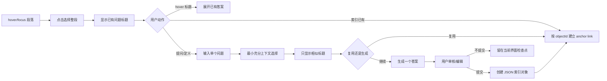

# UX 规格：段落锚点上的单问单答

> 状态：Confirmed direction / 细节待原型
> 对应需求：FR-001–FR-045、FR-050–FR-054、FR-080–FR-084

## 1. 体验目标

ReadWeave 是 Trilium Web 阅读界面的一层交互，不是另一个聊天产品。用户仍然看文章；问题和答案按稳定 ID 连接到段落锚点，只有需要时才展开。

核心体验标准：

- hover 段落即可发现这里有多少问题。
- 点击段落等于选择完整段落，不需要拖动选择文本。
- 初始只看问题标题，hover/focus 某一问题才展开答案。
- 每次生成只有一问一答，没有多轮聊天历史。
- 未经审核的答案只留在当前界面，不进入索引库。
- 重复提示只显示标题且不阻止提交；hover 后才显示具体内容。
- 修改索引对象后，所有相同 objectId 的锚点显示最新内容。

## 2. Web 页面信息架构

### 2.1 文章层

每个可索引段落有稳定 `anchorId`。正常阅读时不显示常驻问答卡片，只显示极轻的 hover/focus 反馈：

- 段落背景或边缘提示。
- 已有问题数量。
- 点击提示“选择整段并打开问题面板”。

触屏没有 hover，因此点击/长按段落提供等价入口。键盘聚焦段落后可用快捷键打开。

### 2.2 段落问题浮层

点击段落后显示：

1. 当前段落摘要和锚点状态。
2. 已连接问题标题列表，仅显示标题。
3. `提问`、`定义术语`、`索引已有` 三个动作。
4. hover/focus 问题标题时的答案预览。

点击标题可以固定预览并显示完整操作；鼠标离开后普通 hover 预览收起。

### 2.3 单问单答面板

面板只服务当前一个问题：

- 当前 articleId/anchorId。
- 问题输入。
- 算法选择的上下文范围。
- 相似标题候选。
- 一个流式答案。
- `重生成`、`编辑`、`提交并连接`、`丢弃`。

不显示聊天历史，不用“继续追问”维持同一会话。新的追问是新的 questionId，但可以通过 `relatedTo`/`variantOf` 关系连接。

## 3. 主流程

## 4. 段落选择与 hover 行为

### 4.1 默认状态

- 无常驻彩色问答块。
- 已有问题的段落可有低干扰标记，但不能改变文章排版。
- 无问题段落 hover 时显示“提问/定义”的轻量入口。

### 4.2 hover/focus 段落

- 指示整个段落会被选中。
- 显示已连接问题数量，例如 `3 个问题`。
- 不自动发送模型请求。
- 不加载全部答案；只预取标题和必要元数据。

### 4.3 点击段落

- 选中整段，视觉上显示明确边界。
- 打开问题标题列表。
- 读取 `articleId + anchorId` 对应的 links。
- 若锚点还不存在，在用户第一次提交/连接时才持久化，避免阅读造成无意义写入。

### 4.4 hover/focus 问题标题

- 展开该 questionId 的最新答案。
- 重名问题/术语必须显示内容、来源文章和 objectId 短码，避免名称冲突。
- 点击固定展开；`Esc` 收起。
- 答案加载失败时显示可恢复状态，不让标题消失。

## 5. 最小充分上下文

“尽可能全、同时尽可能少”不是固定窗口大小，而是逐级扩张策略：

1. `L0`：选中段落、标题层级、用户问题。
2. `L1`：相邻前后段和当前小节标题。
3. `L2`：当前章节。
4. `L3`：整篇文章的相关段落检索结果。
5. `L4`：与当前锚点连接的术语/问题索引对象。
6. `L5`：用户明确允许的其他笔记或外部网页。

选择器先判断当前层是否足够回答；不足才扩张。界面显示：

- 实际采用层级。
- 包含的段落/对象数量。
- 预计 token。
- 为什么扩张或停止。

用户可以手动限制到某一层或查看实际内容，但正常流程不要求用户逐项组装上下文。

## 6. 相似候选

### 6.1 初始展示

候选只显示问题或术语标题，最多显示配置数量。高置信候选突出 `索引已有` 主动作，但不禁用 `仍然提交`。

### 6.2 hover/focus 展示

- 当前答案/定义摘要或完整内容。
- 来源 article/anchor。
- objectId 短码。
- 匹配原因只放在次级详情，不污染标题列表。

### 6.3 用户动作

- `索引到当前锚点`
- `创建变体`
- `仍然提交新对象`
- `标记这两个对象不是重复`

同名不等于同一对象；所有动作以 ID 为准。

## 7. 生成、审核与提交

### 7.1 生成

- DeepSeek 为首发 Provider。
- 单次只生成一个最终答案。
- 支持流式、停止、重生成。
- 重生成替换当前界面候选答案，不自动创建新索引对象。

### 7.2 未提交状态

生成完成但未审核时：

- 答案留在当前 Web 界面检查点。
- 不进入问题标题列表。
- 不写入正式 objects/links 索引。
- 切换文章后按 articleId/anchorId 隔离，返回时可以恢复当前会话内检查点。
- 浏览器刷新或检查点过期前必须提示未提交内容可能消失；持久化策略由架构 ADR 决定，但不得混入正式索引。

### 7.3 提交

用户点击 `提交并连接` 后：

1. 校验问题/术语格式和答案结构。
2. 创建不可变 objectId。
3. 保存 JSON 索引对象和修订。
4. 建立 articleId + anchorId + objectId link。
5. 标题出现在当前段落问题列表。

## 8. 术语与英文格式

所有术语标题和首次定义必须符合：

- 有缩写：`缩写 中文全称（英文全称）`
- 无缩写：`中文全称（英文全称）`

示例：

- `NPU 神经处理单元（Neural Processing Unit）`
- `传输层安全协议（Transport Layer Security）`

规则：

- 缩写大小写保持官方写法。
- 中文全称与英文全称必须来自可靠来源或由用户审核。
- 标题校验失败时提示修改，不静默重排技术标识。
- 只有英文名而没有可靠中文全称时，标记待审核，不凭空创造正式译名。

## 9. 编辑与全局传播

打开索引对象编辑时显示：

- objectId 短码与类型。
- 当前连接的文章数、锚点数。
- 来源和最新修订。
- `全局修改`、`本文变体`、`只改显示`。

用户确认全局修改后，所有 links 继续指向同一个 objectId，因此无需批量改写文章；下一次展开即读取最新内容。

## 10. 显式回答规则

不使用“学习画像”概念。设置页只提供用户可直接理解、手动修改的确定性规则：

- 回答语言。
- 默认深度和最大长度。
- 是否要求定义、机制、例子、反例、公式、代码、来源。
- 术语标题格式（强制规则不可关闭）。
- 相似候选数量和阈值。
- 上下文最大扩张层级/token 预算。
- DeepSeek 模型和推理模式。

应用不得因用户接受、拒绝或编辑某个答案而自动改变规则。

## 11. 错误与恢复

| 状态 | 必须说明 | 用户动作 |
|---|---|---|
| DeepSeek 未配置/密钥失效 | 已保存索引不受影响 | 配置服务端密钥、继续阅读/索引已有 |
| 生成中断 | 当前界面内容仍在，尚未提交 | 重生成、编辑、丢弃 |
| 上下文过长 | 采用了哪些层级、何处截断 | 限制/扩张层级、继续 |
| 高相似候选 | 只显示标题，hover 可比较 | 索引、变体、仍提交 |
| object 被删除 | 哪些 links 失效 | 恢复、替换、移除 link |
| anchor 漂移 | 原段落可能改变 | 重新定位、保留历史、移除 |
| 索引损坏 | Trilium 真相数据仍在 | 重建索引、导出健康报告 |
| 未提交检查点即将消失 | 内容尚未正式保存 | 提交、复制、丢弃 |

## 12. 无障碍与触屏

- hover 必须有 focus 和 click 等价行为。
- 问题标题列表可仅用键盘浏览，焦点标题展开答案。
- `Esc` 收起预览，`Enter` 固定/打开，快捷键可重映射。
- 触屏点击段落打开列表，点击标题展开答案。
- 状态不能只靠颜色。
- 目标遵循 WCAG 2.2 AA 的相关 Web 要求。

## 13. UX 验收

1. 一篇至少 100 个段落问题组的文章无需常驻卡片仍能快速定位与查看。
2. hover 段落到标题出现、hover 标题到答案出现达到性能阈值。
3. 未提交答案切换文章后仍按锚点隔离，且绝不出现在正式索引导出中。
4. 同名对象通过内容和 ID 能明确区分。
5. 用户始终知道当前动作是索引已有、创建变体、提交新对象还是全局修改。
6. 键盘和触屏不依赖 hover 也能完成同一流程。
