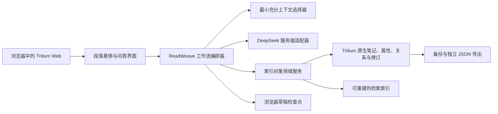
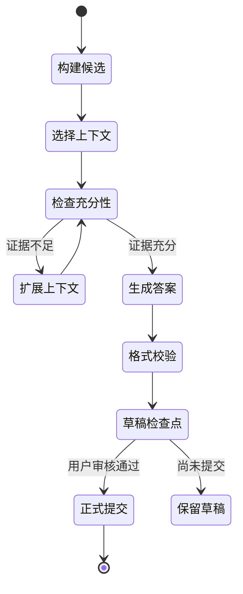

# ReadWeave（织读）技术架构

> 状态：实现基线 v0.3
> 日期：2026-07-14
> 目标：基于 Trilium Server/Web 构建可长期维护、可备份、可审计的个人阅读器。

## 1. 已冻结的架构结论

1. 主运行形态是 Trilium Server 加浏览器，不以桌面客户端为首发入口。
2. Trilium 的笔记、修订、属性、关系、保护继承和备份仍是真相源。
3. 问答和术语定义统一称为“索引对象”；文章只通过不可变标识符引用对象，不通过名称引用。
4. 一次生成只对应一个问题和一个答案，不建立多轮聊天数据结构。
5. 生成结果在用户提交前只是“草稿检查点”，不创建正式索引对象或文章连接。
6. 修改索引对象后，所有连接位置读取同一最新内容；“本文变体”会创建新对象，“只改显示”只改变连接的显示设置。
7. DeepSeek 是首个联网模型提供方；密钥只存在于服务端安全配置，不进入浏览器、Trilium 笔记、导出文件、日志或仓库。
8. 当前不实现跨设备同步和多人协作，但必须完成备份、恢复、索引重建和独立导出。
9. 不使用本地模型。精确匹配、全文检索、哈希等普通算法可以在本地执行；需要语义判断时调用联网模型。
10. 工作流采用版本化 JSON（JavaScript 对象表示法，JavaScript Object Notation）状态、检查点和评测工具；不为了框架而强制引入 LangChain 或 LangGraph。

## 2. 系统边界



边界规则：

- 浏览器只能调用 ReadWeave 服务端接口，不能直接得到 DeepSeek 密钥。
- 正式知识只存在于 Trilium 真相数据；检索索引删除后可以从真相数据重建。
- 草稿检查点不是正式知识，不参与相似对象搜索、全局引用或导出。
- 文章内容与索引对象都通过 Trilium 原生访问判断；界面只有在当前用户能读取两端时才渲染连接。

## 3. 模块划分

| 模块 | 建议位置 | 职责 |
|---|---|---|
| `readweave-client` | `apps/client/src/widgets/sidebar/ReadWeavePanel.tsx` | 段落悬停、整段选择、标题列表、答案展开和草稿审核 |
| `readweave-editor` | `packages/ckeditor5/src/plugins/readweave_anchor.ts` | 把段落锚点持久化到编辑器模型 |
| `readweave-server` | `apps/server/src/services/readweave_repository.ts` | 权限、对象、连接、影响范围、变体、显示覆盖和导出 |
| `readweave-domain` | `packages/commons/src/lib/readweave.ts` | 版本化对象、连接、上下文、请求和导出类型 |
| `readweave-context` | `apps/server/src/services/readweave_engine.ts` | 确定性上下文预算和相似标题候选 |
| `readweave-provider` | `apps/server/src/services/readweave_ai.ts` | DeepSeek 服务端单问单答适配与匿名测试替身 |
| `readweave-index` | Trilium 隐藏对象与连接子树 | 标题归一化、相似候选和稳定标识符引用 |
| `readweave-harness` | `apps/server-e2e/src/readweave.spec.ts` | 审核、复用、修改传播和导出的浏览器回归流程 |
| `readweave-export` | `docs/readlayer/schemas/readweave-index-export.schema.json` | 文章、锚点、对象、连接和完整性摘要的独立 JSON 文件 |

领域模块不能依赖具体界面组件或某个模型名称。提供方、物理存储和编辑器表现都通过适配器隔离。

## 4. 数据模型

### 4.1 标识符规则

| 标识符 | 含义 | 规则 |
|---|---|---|
| `articleId` | 文章标识符 | 直接使用 Trilium `noteId`；标题或路径变化不影响它 |
| `anchorId` | 段落锚点标识符 | 创建后不可变；与段落元素一起持久化 |
| `objectId` | 索引对象标识符 | 直接使用索引对象笔记的 Trilium `noteId` |
| `linkId` | 连接标识符 | 唯一连接 `articleId + anchorId + objectId`，允许同名对象并存 |
| `revisionId` | 内容版本标识符 | 指向 Trilium 修订或 ReadWeave 版本号，用于影响范围与审计 |

任何名称、缩写、问题文本、答案文本或标题都不是连接键。重复名称只影响候选展示，不影响引用正确性。

### 4.2 索引对象 `IndexObject`

索引对象有两种首发类型：

- `question`：一个问题和一个已审核答案；
- `term`：一个术语及其已审核定义。

建议逻辑结构：

```json
{
  "schemaVersion": "1.0",
  "objectId": "trilium-note-id",
  "kind": "question",
  "title": "受保护 RTL 具体指哪部分受保护？",
  "answer": "已审核答案",
  "status": "active",
  "revisionId": "revision-id",
  "formatRuleVersion": "zh-en-1",
  "source": {
    "createdFromArticleId": "article-note-id",
    "createdFromAnchorId": "anchor-id"
  },
  "generation": {
    "provider": "deepseek",
    "model": "configured-model-name",
    "workflowVersion": "context-v1",
    "promptHash": "sha256-value"
  }
}
```

术语对象额外保存 `abbreviation`、`zhName`、`enName`，由渲染器确定性生成：

- 有缩写：`缩写 中文全称（英文全称）`；
- 无缩写：`中文全称（英文全称）`。

用户手写内容不被静默重写；生成结果在审核区显示格式校验错误，用户确认修正后才能提交。

### 4.3 段落锚点 `Anchor`

```json
{
  "anchorId": "anchor-id",
  "articleId": "article-note-id",
  "selector": {
    "type": "readweave-paragraph-v1",
    "value": "persistent-editor-marker"
  },
  "fingerprint": {
    "normalizedTextHash": "sha256-value",
    "headingPathHash": "sha256-value"
  }
}
```

锚点必须由编辑器插件作为模型数据持久化，不能只依赖易变的文档对象模型位置或第几个段落。文本哈希和标题路径只用于锚点损坏后的候选修复，不能代替 `anchorId`。

### 4.4 连接 `ObjectLink`

```json
{
  "linkId": "link-id",
  "articleId": "article-note-id",
  "anchorId": "anchor-id",
  "objectId": "object-note-id",
  "display": {
    "order": 10,
    "collapsed": true,
    "titleOverride": null
  }
}
```

“只改显示”只能修改 `display`；“全局修改”修改 `IndexObject`；“本文变体”复制为新 `objectId`，然后只把当前 `linkId` 改指向新对象。

### 4.5 草稿检查点 `DraftCheckpoint`

草稿检查点只存在于当前浏览器标签页的 `sessionStorage` 中，实际保存结构为：

```json
{
  "kind": "question",
  "title": "用户问题",
  "body": "尚未提交的模型回答",
  "reuseObjectId": "optional-object-id"
}
```

规则：

- 未提交草稿按 `articleId + anchorId` 隔离；切换文章或刷新当前标签页后可以恢复，关闭标签页或清理会话数据后不再保证保留。
- 草稿不写入 Trilium 正式笔记，不参与备份承诺；界面必须明确标记“未保存”。
- 提交时服务端重新校验权限、锚点、相似候选和内容格式，然后以一个原子用例创建对象与连接。
- 丢弃、过期或浏览器数据清除都会删除草稿；不能把它描述为永久保存。

## 5. Trilium 物理映射与权限

### 5.1 首选映射

- 索引对象使用原生 Trilium note，正文保存答案或定义，属性保存类型、模式版本和结构字段。
- 对象默认放在 ReadWeave 对象库中；从受保护文章创建时，默认放在同等保护范围的对象库或来源文章分支下。
- 连接记录必须位于文章权限范围内，并保存 `articleId`、`anchorId`、`objectId`。
- 搜索索引是派生文件，不是新的真相表；其条目只在请求者有权读取对象时返回。

### 5.2 权限判定

展示一个连接必须同时满足：

1. 用户能读取当前文章；
2. 用户能读取被连接的索引对象；
3. 用户能读取或推导该文章内的连接记录。

对象从受保护来源连接到更开放文章时，不降低对象权限，也不把对象正文复制到开放文章。无读取权限时只显示不可访问状态，不泄露标题、摘要或相似度。首发不自建角色和访问控制列表，完全复用 Trilium 原生继承语义。

### 5.3 物理实现的验证门

隐藏连接笔记、关系属性或专用实体都只是候选实现。原型必须用 1 千、1 万和 5 万条连接验证启动、搜索、备份、恢复和编辑性能后再冻结。导出协议和领域接口保持不变，因此物理实现可以更换而不破坏产品数据。

## 6. 段落交互与实时更新

### 6.1 段落定位

编辑器插件为可提问段落创建稳定锚点。阅读时：

1. 鼠标悬停或键盘聚焦段落，显示轻量提示；
2. 点击段落选择整段；
3. 服务端按 `articleId + anchorId` 返回问题标题；
4. 悬停、聚焦或点击标题时按 `objectId` 读取最新答案；
5. 问题很多时虚拟化标题列表，不向文章正文插入常驻卡片。

触屏和键盘必须有与悬停等价的点击、聚焦和关闭操作。

### 6.2 全局修改

用户尝试修改被引用对象时，服务端先按 `objectId` 计算影响范围：连接数量、文章数量、文章标题和不可访问数量。用户选择后执行：

- 全局修改：更新原对象，所有连接下一次读取时立即获得新修订；
- 本文变体：创建新对象并重定向当前连接；
- 只改显示：只更新当前连接显示字段。

客户端通过对象变更事件使已展开位置失效并重新读取；不批量改写文章正文。

## 7. 最小充分上下文选择

### 7.1 候选层级

| 层级 | 候选内容 |
|---|---|
| L0 | 用户问题、完整目标段落 |
| L1 | 标题路径、前后相邻段落 |
| L2 | 当前小节的其他段落、图表题注、脚注 |
| L3 | 当前文章摘要、元数据和已保存相关对象 |
| L4 | 当前文章中与问题词项精确或全文匹配的其他小节 |
| L5 | 用户显式允许的 Trilium 链接笔记或公共来源片段 |

L0 是固定必选项。其余层级由确定性候选生成器构建，再由上下文规划步骤选择。目标不是固定“越多越好”，而是用最少片段达到可回答置信度。

### 7.2 工作流状态图



每一步输入输出都通过版本化 JSON 模式校验。状态记录候选标识符、选择原因、置信度、提供方、模型、提示词哈希、耗时和用量；不默认保存未授权的完整外部内容。

### 7.3 确定性边界

“应用确定性”定义为：同一显式设置和同一状态会走相同的规则、不会暗中学习偏好、不会静默改变上下文层级或保存行为。联网生成模型本身可能返回不同措辞，因此不能承诺逐字一致。降低波动的方法包括固定工作流版本、显式模型配置、低随机度、结构化输出校验、失败重试规则和完整评测记录。

### 7.4 框架选择

- 必须使用：JSON 模式、显式状态机、可恢复检查点、评测工具、回归数据集。
- 首选实现：与 Trilium 相同技术栈的 TypeScript 显式状态机，减少运行时和升级面。
- LangChain/LangGraph：只有在分支、暂停恢复、人工审核节点或追踪需求超过自有状态机能力，并通过技术验证后再引入；它们不能充当知识数据库或对象标识符系统。
- 任何框架替换都不得改变导出模式、正式对象语义和审核后保存规则。

## 8. 相似对象索引

候选流水线：

1. 标准化问题或术语，计算精确键和内容哈希；
2. 使用 Trilium 全文检索召回候选；
3. 可选地调用联网模型对候选做语义判断和排序；
4. 高置信候选突出“复用”，但永远不阻止创建新对象或变体；
5. 初始界面只显示标题，悬停、聚焦或点击后显示内容、来源文章和对象标识符片段。

同名术语可以对应多个 `objectId`。排序使用内容和来源，不合并同名对象。阈值、候选数和排序版本都是显式配置并进入评测记录。

本地派生索引可使用 SQLite 全文检索和普通哈希；它们不是本地模型。若以后采用向量检索，向量必须来自允许的联网服务，且索引仍可完全重建。

## 9. DeepSeek 服务端适配

提供方接口至少统一：

- 流式文本事件；
- 停止和超时；
- 结构化 JSON 输出校验；
- 输入输出用量；
- 可重试和不可重试错误；
- 服务地址和模型名称的显式配置；
- 能力声明，不假定兼容接口支持所有功能。

安全规则：

- 密钥通过服务端环境变量或外部秘密管理注入，变量名为 `READWEAVE_DEEPSEEK_API_KEY`；仓库只保存示例变量名和占位值。
- 浏览器网络响应、源映射、错误页、遥测和诊断包不得包含密钥。
- 模型名称不得硬编码到知识对象；官方模型发生变化时只改服务配置。
- 提交给模型前按 Trilium 当前用户权限构建上下文；服务端不得跨越不可读笔记检索内容。
- 所有模型文本按纯文本或允许列表富文本渲染，禁止执行脚本和危险链接。

已暴露在聊天中的密钥视为失效，必须由用户在提供方控制台吊销并生成新密钥后，才能开始真实接口测试。

## 10. 事务、一致性与恢复

提交正式对象的服务端用例：

1. 校验当前用户、文章和锚点权限；
2. 再次读取相似候选，并保留用户明确选择；
3. 校验答案和术语格式；
4. 创建或复用索引对象；
5. 创建连接；
6. 写入修订和审计元数据；
7. 提交事务后更新派生索引；
8. 返回 `objectId`、`linkId` 和 `revisionId`。

第 4 至 6 步必须原子化；任何失败都不产生半个正式对象。派生索引失败不能回滚真相数据，而是标记待重建。

删除连接默认不删除索引对象。删除仍被连接的对象必须先显示影响范围，并要求取消、解除全部连接或以另一个对象替换。孤立对象由显式清理工具处理，不自动删除。

## 11. 备份、恢复与导出

- 首发依赖 Trilium 原生数据库备份覆盖索引对象、连接和修订。
- 每次 ReadWeave 模式升级、上游数据库升级或批量修改前创建并验证备份。
- 恢复演练必须验证对象数量、连接数量、锚点解析率、修订、保护继承和派生索引重建。
- 当前不承诺 ReadWeave 跨设备同步；界面不得暗示草稿或派生索引已同步。
- 独立导出使用 `08-INDEX-EXPORT.md` 和 JSON 模式，至少包含问题、答案、术语、文章、锚点、对象连接与修订信息。
- 导出不包含服务密钥、草稿检查点、不可访问正文或派生向量。

## 12. 测试架构

| 层次 | 重点 |
|---|---|
| 单元测试 | JSON 模式、标识符、术语格式、上下文层级、相似阈值、状态转换 |
| 服务集成测试 | Trilium 原生实体映射、权限继承、事务、修订、备份和恢复 |
| 提供方契约测试 | DeepSeek 流式输出、中止、错误、结构化结果、模型配置变化 |
| 编辑器测试 | 锚点在复制、剪切、撤销、标题变化、段落拆分和合并后的行为 |
| 端到端测试 | 段落点击、标题列表、答案悬停、审核提交、复用、变体、全局更新和导出 |
| 评测工具 | 多种公开文章、上下文充分率、无关上下文率、答案审核通过率和重复候选质量 |
| 性能测试 | 100 个问题的段落、1 万段长文、5 万对象/连接、索引重建和备份恢复 |
| 安全测试 | 密钥泄漏、跨权限检索、提示词注入、危险富文本和导出越权 |

## 13. 上游维护策略

- 基线固定为已验证的 TriliumNext 稳定标签，不直接跟随主分支。
- ReadWeave 代码集中在命名目录和适配层，减少对上游核心文件的散乱修改。
- 每次上游升级先在兼容分支完成构建、数据副本升级、编辑器回归、备份恢复和完整评测。
- 模式版本、工作流版本、提示词版本和导出版本独立演进。
- 真实日常库只在副本演练和恢复演练通过后升级。

## 14. 后续候选版本必须完成的架构验证

1. 锚点插件能在编辑、复制、撤销、拆分和合并后保持或明确修复 `anchorId`。
2. 原生 note/attribute/relation 方案在 5 万连接下达到性能门槛。
3. 受保护文章、开放文章和共享索引对象之间不存在标题或正文泄漏。
4. 草稿检查点在未提交时绝不进入正式对象、相似索引和导出。
5. DeepSeek 密钥不会出现在浏览器、日志、数据库、备份或导出中。
6. 上下文选择工具能证明“充分”与“精简”同时达到验收阈值。
7. 对象修改一次后，所有连接位置读到同一修订；变体和只改显示不污染全局对象。
8. JSON 导出可以独立校验，所有连接都能解析到存在的文章、锚点和对象。
